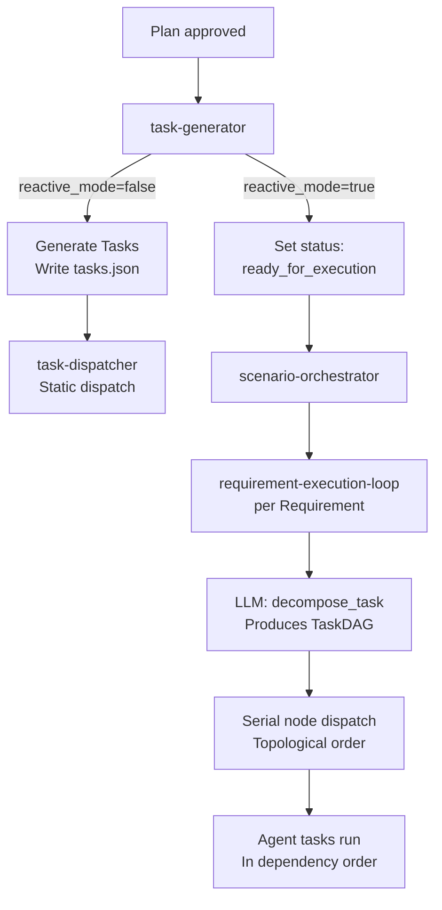
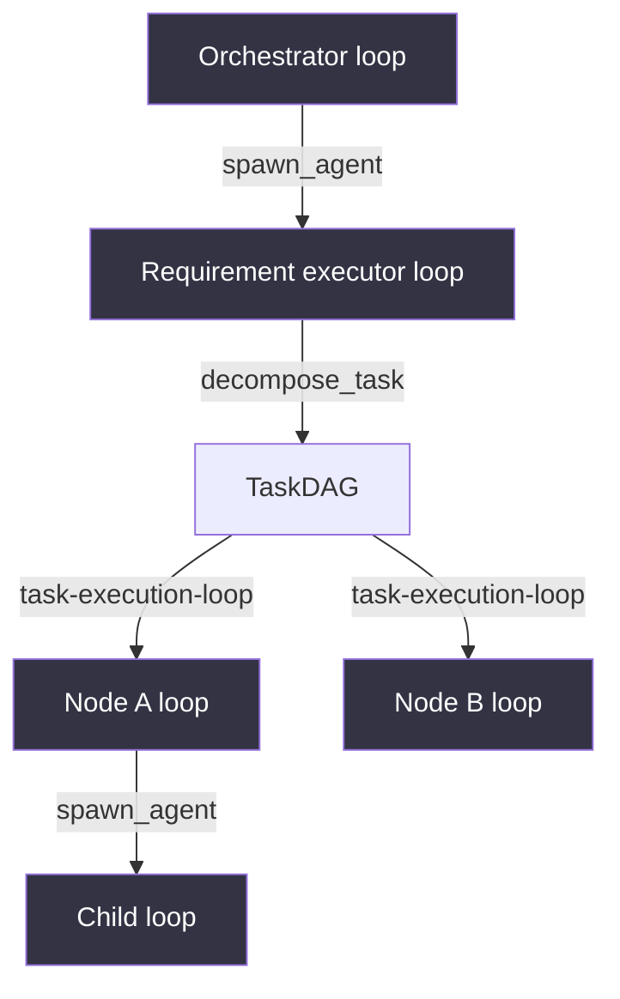

# Semspec Architecture

> **New to semspec?** Read [How Semspec Works](01-how-it-works.md) first for a progressive introduction to the system.

Semspec is a **semstreams extension** - it imports semstreams as a library, registers custom components, and runs them
via the component lifecycle.

## System Overview

```
┌─────────────────────────────────────────────────────────────────────────────┐
│  DOCKER COMPOSE (infrastructure)                                             │
│                                                                              │
│  ┌──────────────────────────────────────────────────────────────────────┐   │
│  │  NATS JetStream (required)                                            │   │
│  │                                                                        │   │
│  │  Streams:    AGENT      WORKFLOWS     GRAPH      USER      SOURCES    │   │
│  │  KV Buckets: ENTITY_STATES  CONTEXT_RESPONSES  PLAN_STATES            │   │
│  │              AGENT_LOOPS    WORKFLOW_EXECUTIONS  LLM_CALLS             │   │
│  └──────────────────────────────────────────────────────────────────────┘   │
│                                                                              │
│  ┌─────────────────────────────────────────────────────┐                   │
│  │  Optional: Ollama (local LLM inference, port 11434)  │                   │
│  └─────────────────────────────────────────────────────┘                   │
└─────────────────────────────────────────────────────────────────────────────┘
                                     ▲
                                     │ NATS
                                     │
┌────────────────────────────────────┴────────────────────────────────────────┐
│  SEMSPEC BINARY  (cmd/semspec/main.go)                                       │
│                                                                              │
│  Startup sequence:                                                           │
│  ├── Global init imports (tools, LLM providers, vocabularies)               │
│  ├── Connect to NATS, ensure streams                                        │
│  ├── Register semstreams components (graph-*, agentic-*, workflow-*)        │
│  ├── Register 16 semspec components                                         │
│  └── Start service manager (HTTP :8080)                                     │
│                                                                              │
│  ┌──────────── Planning ────────────────────────────────────────────────┐   │
│  │  planner                Single-planner path; fallback or standalone   │   │
│  │  plan-manager           REST API; sole writer for plan entities       │   │
│  │  plan-reviewer          SOP-aware plan validation with LLM review     │   │
│  │  requirement-generator  LLM → Requirements from plan goal            │   │
│  │  scenario-generator     LLM → BDD Scenarios from Requirements        │   │
│  └──────────────────────────────────────────────────────────────────────┘   │
│                                                                              │
│  ┌──────────── Execution ───────────────────────────────────────────────┐   │
│  │  scenario-orchestrator   Dispatches requirement-execution-loop per   │   │
│  │                          pending Requirement                         │   │
│  │  requirement-executor    Decomposes Requirements into DAGs; serial   │   │
│  │                          node dispatch + requirement-level review    │   │
│  │  execution-manager       TDD pipeline per node: tester → builder     │   │
│  │                          → validator → reviewer                      │   │
│  │  change-proposal-handler ChangeProposal OODA loop + dirty cascade    │   │
│  └──────────────────────────────────────────────────────────────────────┘   │
│                                                                              │
│  ┌──────────── Support ─────────────────────────────────────────────────┐   │
│  │  project-manager     Project management REST endpoints               │   │
│  │  workflow-validator  Document structure validation (request/reply)   │   │
│  │  workflow-documents  File output to .semspec/plans/                  │   │
│  │  structural-validator  Schema and payload validation                 │   │
│  │  question-answerer   LLM question answering for knowledge gaps       │   │
│  │  question-router     Routes questions to registered answerers        │   │
│  │  question-timeout    SLA monitoring and escalation (disabled default)│   │
│  └──────────────────────────────────────────────────────────────────────┘   │
│                                                                              │
│  ┌──────────── Semstreams (library — not registered here) ──────────────┐   │
│  │  context-builder    Strategy-based LLM context assembly              │   │
│  │  task-generator     Plan → task decomposition                        │   │
│  │  task-dispatcher    Dependency-aware task execution via agent loops  │   │
│  │  graph-*, agentic-*, workflow-processor, message-logger, …          │   │
│  └──────────────────────────────────────────────────────────────────────┘   │
└─────────────────────────────────────────────────────────────────────────────┘
```

## Component Registration Pattern

All 16 semspec components are registered in `cmd/semspec/main.go` alongside the full semstreams component suite.
Tools, LLM providers, and vocabularies register themselves via package-level `init()` functions triggered by blank
imports.

```go
// cmd/semspec/main.go

// Global init imports — register before any component starts
import (
    _ "github.com/c360studio/semspec/tools"            // bash, spawn, decompose, submit, question, review
    _ "github.com/c360studio/semspec/llm/providers"    // anthropic, ollama LLM providers
    _ "github.com/c360studio/semspec/vocabulary/source" // source.* predicate vocabulary
)

func registerSemspecComponents(componentRegistry *component.Registry) error {
    // All semstreams components: graph-*, agentic-*, workflow-processor, etc.
    componentregistry.Register(componentRegistry)

    // Semspec components (16 total) — each returns an error on registration failure
    type registerFn func() error
    steps := []registerFn{
        func() error { return workflowvalidator.Register(componentRegistry) },
        func() error { return workflowdocuments.Register(componentRegistry) },
        func() error { return questionanswerer.Register(componentRegistry) },
        func() error { return questionrouter.Register(componentRegistry) },
        func() error { return questiontimeout.Register(componentRegistry) },
        func() error { return requirementgenerator.Register(componentRegistry) },
        func() error { return scenariogenerator.Register(componentRegistry) },
        func() error { return planner.Register(componentRegistry) },
        func() error { return planmanager.Register(componentRegistry) },
        func() error { return planreviewer.Register(componentRegistry) },
        func() error { return projectmanager.Register(componentRegistry) },
        func() error { return structuralvalidator.Register(componentRegistry) },
        func() error { return executionmanager.Register(componentRegistry) },
        func() error { return requirementexecutor.Register(componentRegistry) },
        func() error { return scenarioorchestrator.Register(componentRegistry) },
        func() error { return changeproposalhandler.Register(componentRegistry) },
    }
    for _, step := range steps {
        if err := step(); err != nil {
            return err
        }
    }
    return nil
}
```

## KV-Driven Pipeline

Semspec coordinates multi-step planning without a central orchestrator. Instead, components watch
the **PLAN_STATES** KV bucket and self-trigger when the plan status they care about appears.
This is the "KV Twofer" pattern: the `plan-manager` write IS the trigger.

### How the Planning Pipeline Self-Coordinates

```
plan-manager                PLAN_STATES KV               Components
     │                            │
     │  POST /plans               │
     │  (status = created)        │
     │ ──────────────────────────▶│
     │                            │──── planner watches ────▶ planner
     │                            │     (revision == 1)        │
     │                            │                            │ Call LLM
     │                            │                            │ Generate Goal/Context/Scope
     │                            │                            │
     │  ◀── requirement.created ──│◀─── status = drafted ─────│
     │                            │
     │                            │──── plan-reviewer watches ▶ plan-reviewer
     │                            │     (status == drafted)     │
     │                            │     (status ==              │ Call LLM
     │                            │      scenarios_generated)   │ SOP validation
     │                            │                            │
     │  ◀── plan approved ────────│◀─── status = reviewed ─────│
```

No trigger subjects or coordinator component is involved. Each component runs an independent
KV watcher alongside its JetStream consumer. The `plan-manager` write sets status; the
interested component reacts within milliseconds.

### Pipeline Stages and Status Transitions

| Status | Set By | Triggers |
|--------|--------|----------|
| `created` | `plan-manager` (POST /plans) | `planner` watcher (revision == 1) |
| `drafted` | `planner` (after LLM generation) | `plan-reviewer` watcher |
| `reviewed` | `plan-reviewer` (after approval) | `requirement-generator` |
| `requirements_generated` | `plan-manager` (on `requirement.created` event) | `scenario-generator` |
| `scenarios_generated` | `plan-manager` (on `scenario.created` event) | `plan-reviewer` watcher (second pass) |
| `ready_for_execution` | `plan-manager` (after second review) | `scenario-orchestrator` |

### Components: Single-Shot Processors

**Pattern**: Watch KV or consume JetStream → Call LLM → Persist result → Advance status

Components handle the "last mile" processing that generic executors cannot: JSON extraction
from LLM markdown responses, typed Go struct validation, and domain-specific persistence.

**Use components when:**

- Calling an LLM and parsing structured output (JSON from markdown-wrapped responses)
- Transforming data between formats
- Domain-specific file I/O (`plan.json`, typed event publishing)
- Single input → single output operations

**Examples in semspec:**

| Component | Self-Trigger Condition | Processing | Output |
|-----------|------------------------|------------|--------|
| `planner` | PLAN_STATES revision == 1 | LLM → Goal/Context/Scope | `plan.json` |
| `plan-reviewer` | PLAN_STATES status == drafted or scenarios_generated | SOP-aware LLM review | Review verdict |
| `requirement-generator` | Plan approved | LLM → Requirements | `requirement.created` event |
| `scenario-generator` | Requirements generated | LLM → BDD Scenarios | `scenario.created` event |
| `workflow-validator` | `workflow.validate.*` subject | Parse markdown → validate | Validation result |

### Decision Framework

```
Need to process LLM output?
├── YES: Need structured parsing?
│   ├── YES → COMPONENT (processor/)
│   │         Self-triggers via KV watcher or JetStream consumer
│   └── NO  → Use agentic-loop directly
└── NO: Status-driven coordination?
    ├── YES → KV-Driven Pipeline (PLAN_STATES + plan-manager)
    └── NO  → Simple command handler or HTTP endpoint
```

## Manager Pattern

Manager components (`plan-manager`, `project-manager`, `execution-manager`) own their entities through
a three-layer architecture that provides hot reads, durable writes, and startup recovery.

### Three-Layer Architecture

```
┌─────────────────────────────────────────────────────────────────┐
│  Layer 1: sscache.Cache[T] — TTL cache (hot reads)               │
│  • O(1) lookups during active execution                          │
│  • from semstreams pkg/cache; generic, TTL-bounded               │
│  • keyed by entity ID; taskIDIndex maps agent task ID → entity  │
├─────────────────────────────────────────────────────────────────┤
│  Layer 2: Domain KV bucket (durable write-through)               │
│  • PLAN_STATES for plans, EXECUTION_STATES for executions       │
│  • full entity JSON — the write IS the event (KV Twofer)        │
│  • reconcile prefers KV on restart (fast, local)                 │
├─────────────────────────────────────────────────────────────────┤
│  Layer 3: TripleWriter → ENTITY_STATES (cross-component facts)   │
│  • key predicates (status, phase, verdict) for rules + queries  │
│  • JSON rules in configs/rules/ react and set terminal status   │
│  • rules own terminal transitions; components own phase steps    │
│  • fallback source during first-ever startup (empty KV bucket)  │
└─────────────────────────────────────────────────────────────────┘
```

### Typed Subjects

Components use `natsclient.NewSubject[T]` for compile-time safe publish and subscribe. Generators
emit typed events that managers consume without ambiguity:

| Subject | Payload Type | Direction |
|---------|--------------|-----------|
| `requirement.created` | `RequirementsGeneratedEvent` | Generator → Manager |
| `scenario.created` | `ScenariosForRequirementGeneratedEvent` | Generator → Manager |

This eliminates dual-writes: generators (requirement-generator, scenario-generator) publish typed
events; `plan-manager` is the **sole writer** for plan entities in the graph. No other component
writes plan entity triples directly.

### Single-Writer Rule

| Entity Type | Sole Writer |
|-------------|-------------|
| Plan triples | `plan-manager` |
| Project triples | `project-manager` |
| Execution triples | `execution-manager` |

### Rules Own Terminal Transitions

JSON rules in `configs/rules/` watch ENTITY_STATES KV entries and fire when an entity reaches
a terminal condition. Components advance phases; rules close them. This keeps terminal logic
declarative and testable outside component code.

### Crash Recovery

On restart, reconcile first checks the domain KV bucket (PLAN_STATES, EXECUTION_STATES) — this
is fast and local. If the bucket is empty (first-ever startup), it falls back to ENTITY_STATES
triples. The TTL cache is rebuilt from whichever source has data. Terminal entities always
persist before in-memory cleanup, so completed/failed/escalated executions are never re-triggered.

### Vocabulary

All workflow predicates are registered in `vocabulary/workflow/` following the 3-part
`domain.category.property` format. Property predicates use scalar Object values; relationship
predicates use `entity_id` data type where Object is a 6-part entity ID, creating a directed
graph edge.

## Reactive Execution Architecture (ADR-025)

ADR-025 introduces a reactive execution model alongside the existing static model. The two modes
are selected via the `reactive_mode` flag on `task-generator`.

### Static vs Reactive Execution Paths



### Scenario Orchestrator

The `scenario-orchestrator` component is the entry point for reactive execution. It receives an
orchestration trigger (`scenario.orchestrate.<planSlug>`) listing pending or dirty Requirements and
fires a `requirement-execution-loop` trigger for each one as a `RequirementExecutionRequest`,
subject to `max_concurrent`. Scenarios are not dispatched as execution units; they are the
acceptance criteria validated at review time by the `requirement-executor`.

```
scenario.orchestrate.<planSlug>
  │
  ▼
scenario-orchestrator
  ├── (concurrent, bounded by max_concurrent)
  ├── workflow.trigger.requirement-execution-loop → Requirement 1
  ├── workflow.trigger.requirement-execution-loop → Requirement 2
  └── workflow.trigger.requirement-execution-loop → Requirement N
```

The orchestrator is deliberately minimal: it dispatches then ACKs. All decomposition and execution
logic lives in the `requirement-executor` component.

### Agent Spawn Hierarchy

Agents in reactive mode can spawn child agents via the `spawn_agent` tool. Each spawn is recorded
in the knowledge graph using the `agentgraph` package, enabling tree queries at runtime.



Spawn depth is capped at `maxDepth` (default: 5). The agent graph records spawn relationships
via `agentgraph.RecordSpawn`, making the hierarchy inspectable for debugging.

### Tool Executors for Reactive Mode

Three tool executors support the reactive execution pipeline:

| Tool | Package | Description |
|------|---------|-------------|
| `decompose_task` | `tools/decompose` | Validates a TaskDAG provided by the LLM; StopLoop=true |
| `spawn_agent` | `tools/spawn` | Publishes a child TaskMessage, waits for completion |
| `review_scenario` | `tools/review` | Submits a scenario review verdict with structured findings |

All follow the `agentic.ToolExecutor` contract: validation errors return `ToolResult.Error`
(forwarded to the LLM as feedback); infrastructure errors return Go errors (logged by the
dispatcher as fatal).

### Agent Graph Vocabulary (`agentgraph` Package)

The `agentgraph` package stores agent hierarchy as graph triples using predicates from
`vocabulary/semspec/predicates.go`:

| Predicate | Direction | Meaning |
|-----------|-----------|---------|
| `agentic.loop.spawned` | parent loop → child loop | Records a spawn relationship |
| `agentic.loop.task` | loop → task entity | Loop owns this task |
| `agentic.task.depends_on` | task → prerequisite task | DAG dependency edge |
| `agentic.loop.role` | loop → string | Functional role of the loop |
| `agentic.loop.model` | loop → string | LLM model used by the loop |
| `agentic.loop.status` | loop → string | Current lifecycle status |

Entity IDs follow the 6-part format: `semspec.local.agentic.orchestrator.{type}.{instance}`.

### Cancellation Signals

When a ChangeProposal is accepted during reactive execution, running loops are cancelled via
`CancellationSignal` messages published to `agent.signal.cancel.<loopID>`. The active
`requirement-execution-loop` observes this signal and transitions to a terminal failed state.
The scenario-orchestrator re-queues affected Requirements for fresh execution.

```
ChangeProposal accepted
  │
  ├── dirty cascade: mark affected Tasks/Scenarios as dirty
  └── publish CancellationSignal → agent.signal.cancel.<loopID>
                                           │
                                   requirement-execution-loop
                                   (transitions to failed)
```

## Graph Node Hierarchy (ADR-024)

The knowledge graph stores all planning artifacts as typed nodes with directed edges. ADR-024
added Requirements, Scenarios, and ChangeProposals as first-class nodes.

```
Plan
  +-- Requirement(s)          (plan-scoped intent)
  |     +-- Scenario(s)       (Given/When/Then as graph entities)
  |           +-- Task(s)     (SATISFIES edge; many-to-many)
  |                 +-- Execution
  +-- Phase(s)                (organizational view; references Tasks)
  +-- ChangeProposal(s)       (lifecycle node; mutates Requirements on acceptance)
```

### Node Types

| Node | ID Format | Key Fields |
|------|-----------|-----------|
| Plan | `semspec.plan.{slug}` | status, goal, context, scope |
| Requirement | `requirement.{plan_slug}.{seq}` | title, description, status (active/deprecated/superseded) |
| Scenario | `scenario.{plan_slug}.{req_seq}.{seq}` | given, when, then[], status (pending/passing/failing/skipped) |
| Task | `semspec.plan.task.{slug}.{id}` | scenarioIDs[], status (includes `dirty`, `blocked`) |
| ChangeProposal | `change-proposal.{plan_slug}.{seq}` | affectedReqIDs[], status lifecycle |
| Phase | `semspec.plan.phase.{slug}.{id}` | task references (unchanged) |

### Node Edges

| Edge | From | To | Direction |
|------|------|----|-----------|
| `BELONGS_TO` | Requirement | Plan | Many-to-one |
| `HAS_SCENARIO` | Requirement | Scenario | One-to-many |
| `SATISFIED_BY` | Scenario | Task | Many-to-many |
| `VALIDATED_BY` | Scenario | Execution | One-to-many |
| `SUPERSEDED_BY` | Requirement | Requirement | Via ChangeProposal |
| `MUTATES` | ChangeProposal | Requirement | One-to-many |
| `INVALIDATES` | ChangeProposal | Task | Computed on acceptance |

### HTTP API Endpoints (ADR-024)

The `workflow-api` component exposes new endpoints for the three new node types:

| Method | Path | Purpose |
|--------|------|---------|
| `GET` | `/plans/{slug}/requirements` | List requirements for a plan |
| `POST` | `/plans/{slug}/requirements` | Create a requirement |
| `GET` | `/plans/{slug}/requirements/{id}` | Get a single requirement |
| `GET` | `/plans/{slug}/scenarios` | List scenarios for a plan |
| `GET` | `/plans/{slug}/scenarios/{id}` | Get a single scenario |
| `GET` | `/plans/{slug}/change-proposals` | List change proposals |
| `POST` | `/plans/{slug}/change-proposals` | Submit a new ChangeProposal |
| `GET` | `/plans/{slug}/change-proposals/{id}` | Get a single proposal |
| `POST` | `/plans/{slug}/change-proposals/{id}/accept` | Accept a proposal (triggers cascade) |
| `POST` | `/plans/{slug}/change-proposals/{id}/reject` | Reject a proposal |

## Semstreams Relationship

Semspec **imports semstreams as a library** and extends it with custom components.

### What Semstreams Provides

| Package / Component | Purpose | How Semspec Uses It |
|---------------------|---------|---------------------|
| `component.Registry` | Component lifecycle management | Creates and manages all components |
| `componentregistry.Register()` | Registers all semstreams components | Gives access to graph, agentic, etc. |
| `natsclient` | NATS connection with circuit breaker | All NATS operations |
| `config.Loader` | Flow configuration loading | Loads `configs/semspec.json` |
| `config.StreamsManager` | JetStream stream management | Creates all streams |
| `pkg/errs` | Error classification | Retry decisions (Nak vs Term) |
| `agentic.ToolCall/ToolResult` | Tool message types | Tool execution protocol |
| `message.Triple` | Graph triple format | AST entity storage |
| `agentic-tools` | Tool dispatcher component | Executes registered tools |
| `workflow-processor` | Workflow state machine executor | Runs declarative workflows |

### Tool Registration

Semspec tools are registered globally via the `tools` package `init()` function—not via a dedicated component.
The semstreams `agentic-tools` component executes them:

```go
// tools/register.go
func init() {
    fileExec := NewRecordingExecutor(file.NewExecutor(absRepoRoot))
    gitExec  := NewRecordingExecutor(git.NewExecutor(absRepoRoot))
    // ...

    for _, tool := range fileExec.ListTools() {
        agentictools.RegisterTool(tool.Name, fileExec)
    }
}
```

`RecordingExecutor` wraps each executor to capture timing, parameters, and results in the `TOOL_CALLS` KV bucket,
enabling trajectory tracking via the semstreams trajectory component.

### Deployment Models

| Model | Components Running | Use Case |
|-------|-------------------|----------|
| **Minimal** | semsource + semstreams `agentic-*` | Code indexing only |
| **With Semstreams** | All above + `graph-*` + `workflow-processor` + semspec processors | Full agentic planning |
| **Full Stack** | All above + `service-manager` + HTTP gateway + UI | Production deployment |

## Tool Dispatch Flow

Tools are registered globally and dispatched by the semstreams `agentic-tools` component. Semspec provides no
separate tool-executor component—the `tools` blank import wires everything at startup.

```
agentic-loop                    NATS                       agentic-tools
     │                            │                            │
     │ ──tool.execute.bash───────▶│──────────────────────────▶│
     │                            │                            │
     │                            │                  Execute(ctx, call)
     │                            │                  Record to TOOL_CALLS
     │                            │                            │
     │ ◀──tool.result.{call_id}───│◀─────────────────────────│
```

**Bash-first approach**: Agents use `bash` for all file, git, and shell operations. Dedicated
`file_*`, `git_*`, and `doc_*` tools have been removed. Specialized tools exist only for
capabilities that bash cannot provide (graph queries, terminal signals, DAG decomposition).

**Registered tool groups:**

| Package | Tools |
|---------|-------|
| `tools/bash` | `bash` — universal shell (files, git, builds, tests, any shell command) |
| `tools/terminal` | `submit_work`, `ask_question` — terminal tools (StopLoop=true) |
| `tools/workflow` | `graph_search`, `graph_query`, `graph_summary` — graph knowledge tools |
| `tools/websearch` | `web_search` — web search (active when `BRAVE_SEARCH_API_KEY` is set) |
| `tools/httptool` | `http_request` — fetch URL, convert HTML→text, persist to graph |
| `tools/decompose` | `decompose_task` — validates LLM-provided TaskDAG (terminal: StopLoop=true) |
| `tools/spawn` | `spawn_agent` — spawns and awaits a child agent loop |
| `tools/review` | `review_scenario` — scenario review verdict tool |

## NATS Subject Patterns

All streams are created at startup by `config.StreamsManager`. The full subject space is:

| Subject | Stream | Direction | Purpose |
|---------|--------|-----------|---------|
| `tool.execute.<name>` | AGENT | Input | Tool execution requests |
| `tool.result.<call_id>` | AGENT | Output | Execution results |
| `tool.register.<name>` | Core NATS | Output | Tool advertisement (ephemeral) |
| `agent.task.development` | AGENT | Internal | Task execution by agentic-loop |
| `agent.task.question-answerer` | AGENT | Internal | Question answering tasks |
| `context.build.>` | AGENT | Input | Context build requests |
| `context.built.<request_id>` | AGENT | Output | Context build responses |
| `question.ask.>` | AGENT | Input | Knowledge gap questions |
| `question.route.>` | AGENT | Internal | Routed question dispatch (question-router) |
| `question.answer.>` | AGENT | Output | Question answers |
| `question.timeout.>` | AGENT | Output | SLA timeout events |
| `question.escalate.>` | AGENT | Output | Escalation events |
| `graph.ingest.entity` | GRAPH | Output | Entities for graph storage |
| `workflow.trigger.planner` | WORKFLOWS | Input | Single-planner path (legacy explicit trigger) |
| `workflow.trigger.plan-reviewer` | WORKFLOWS | Input | Plan review (legacy explicit trigger) |
| `workflow.trigger.task-generator` | WORKFLOWS | Input | Task generation |
| `workflow.trigger.task-dispatcher` | WORKFLOWS | Input | Task dispatch |
| `workflow.trigger.change-proposal-loop` | WORKFLOWS | Input | ChangeProposal OODA loop |
| `workflow.result.<component>.<slug>` | WORKFLOWS | Output | Component completion signals |
| `workflow.validate.*` | WORKFLOWS | Input | Document validation |
| `output.workflow.documents` | WORKFLOWS | Input | Document export |
| `requirement.created` | WORKFLOWS | Output | New requirement published |
| `requirement.updated` | WORKFLOWS | Output | Requirement mutated by ChangeProposal |
| `scenario.created` | WORKFLOWS | Output | New scenario published |
| `scenario.status.updated` | WORKFLOWS | Output | Scenario status changed |
| `task.dirty` | WORKFLOWS | Output | Dirty cascade: affected task IDs |
| `change_proposal.created` | WORKFLOWS | Output | New ChangeProposal submitted |
| `change_proposal.accepted` | WORKFLOWS | Output | Proposal accepted; cascade complete |
| `change_proposal.rejected` | WORKFLOWS | Output | Proposal rejected; no graph mutations |
| `source.ingest.>` | SOURCES | Input | Document/SOP ingestion |
| `source.status.>` | SOURCES | Output | Ingestion status |
| `user.message.>` | USER | Input | User messages (agentic-dispatch) |
| `scenario.orchestrate.*` | WORKFLOWS | Input | Orchestration trigger per plan slug |
| `workflow.trigger.requirement-execution-loop` | WORKFLOWS | Input | Per-Requirement execution trigger |
| `workflow.trigger.task-execution-loop` | WORKFLOWS | Input | Per-task TDD pipeline trigger |
| `agent.task.testing` | AGENT | Internal | TDD tester stage dispatch |
| `agent.task.building` | AGENT | Internal | TDD builder stage dispatch |
| `agent.task.validation` | AGENT | Internal | TDD validator stage dispatch |
| `agent.task.reviewer` | AGENT | Internal | TDD reviewer stage dispatch |
| `agent.task.red-team` | AGENT | Internal | Scenario red team challenge (teams mode only) |
| `agent.task.scenario-reviewer` | AGENT | Internal | Requirement-level reviewer dispatch |
| `workflow.events.scenario.execution_complete` | WORKFLOWS | Output | Requirement execution completed |
| `workflow.trigger.plan-rollup-review` | WORKFLOWS | Input | Plan rollup review trigger |
| `agent.complete.>` | AGENT | Internal | Agentic loop completion (fan-out) |
| `agent.signal.cancel.*` | Core NATS | Input | Cancellation signal to a running loop (ephemeral) |

**JetStream subjects** are durable and replay-capable. **Core NATS subjects** (`tool.register.*`) are ephemeral
request/reply with no persistence.

## Provenance Flow

Tool executors emit PROV-O triples to enable "who changed what when" queries:

```
┌─────────────────────────────────────────────────────────────────────────────┐
│  PROVENANCE FLOW: Tool Execution → Graph                                     │
│                                                                              │
│  1. USER REQUEST                                                            │
│     User → agentic-loop (via /message HTTP or CLI)                         │
│             │                                                               │
│             │ prov:wasAssociatedWith                                        │
│             ▼                                                               │
│  2. LOOP CREATES TOOL CALL                                                  │
│     Loop → tool.execute.bash                                                │
│             │                                                               │
│             │ agent.activity.loop                                           │
│             ▼                                                               │
│  3. TOOL EXECUTOR RUNS                                                      │
│     agentic-tools executes bash via RecordingExecutor                       │
│             │                                                               │
│             │ Emits provenance triples:                                     │
│             │ • prov.generation.activity → tool_call_id                    │
│             │ • prov.attribution.agent   → loop_id                         │
│             │ • prov.time.generated      → timestamp                       │
│             ▼                                                               │
│  4. GRAPH STORES PROVENANCE                                                 │
│     graph-ingest receives triples                                           │
│     graph-index makes queryable                                             │
│             │                                                               │
│             ▼                                                               │
│  5. QUERY PROVENANCE                                                        │
│     "What files did loop X create?"                                        │
│     "Who modified auth.go since Tuesday?"                                  │
│     "Show audit trail for this proposal"                                   │
│                                                                              │
└─────────────────────────────────────────────────────────────────────────────┘
```

### Provenance Predicates

| Predicate | Type | Direction | Usage |
|-----------|------|-----------|-------|
| `prov.generation.activity` | entity → tool_call | Output | File was generated by this tool call |
| `prov.attribution.agent` | entity → loop | Output | Entity attributed to this loop |
| `prov.usage.entity` | tool_call → entity | Input | Tool call used this entity as input |
| `prov.time.generated` | entity → datetime | Metadata | When entity was created |
| `prov.time.started` | activity → datetime | Metadata | When activity started |
| `prov.time.ended` | activity → datetime | Metadata | When activity ended |

## Related Documentation

| Document | Description |
|----------|-------------|
| [How Semspec Works](01-how-it-works.md) | Progressive introduction to the system |
| [Getting Started](02-getting-started.md) | Quick start guide |
| [Components](04-components.md) | Component configuration and creation guide |
| [Workflow System](05-workflow-system.md) | LLM-driven workflows, model selection, validation |
| [Question Routing](06-question-routing.md) | Knowledge gap resolution, SLA, escalation |
