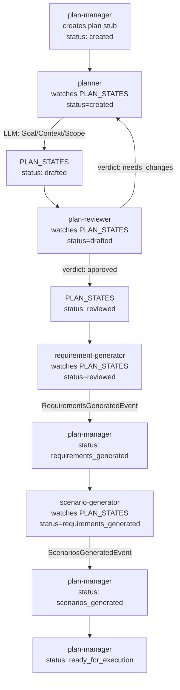
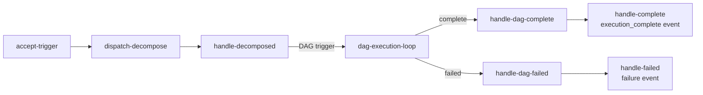
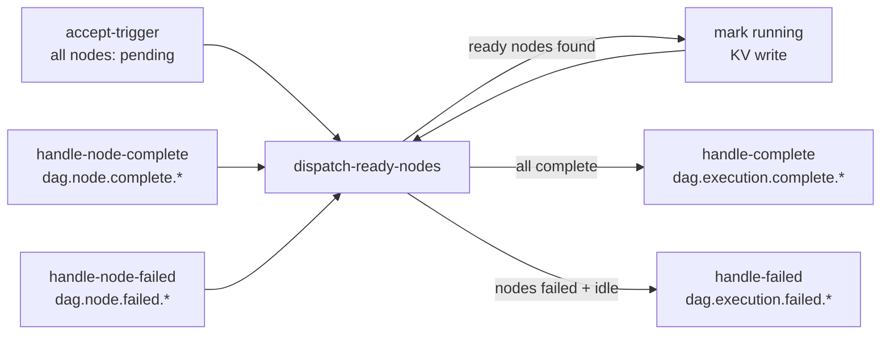

# Workflow System

This document describes the LLM-driven workflow system in semspec, including capability-based model
selection, the KV-driven planning pipeline, and specialized processing components.

## Overview

Semspec uses component-based processors for all LLM-driven work. Each component subscribes to a
NATS subject, performs a focused LLM call, and advances plan state via the `PLAN_STATES` KV bucket.

Components watch the KV bucket for status changes and self-trigger — there is no central coordinator
and no JSON workflow definition files. The pipeline is a chain of status-driven reactions:

```
created → drafted → reviewed → approved
  → requirements_generated → scenarios_generated
  → ready_for_execution → implementing → complete
```

See [Architecture: Components vs Workflows](03-architecture.md#components-vs-workflows) for
additional context.

## Specialized Processing Components

For single-shot LLM operations that require structured output parsing, semspec uses dedicated
components. Each component subscribes to its own NATS subject, calls the LLM, parses a structured
JSON response, and advances plan state by writing to `PLAN_STATES`.

| Component | Trigger | Processing | Output |
|-----------|---------|------------|--------|
| `planner` | Status `created` in `PLAN_STATES` | Single LLM → Goal/Context/Scope | Sets status `drafted` |
| `plan-reviewer` | Status `drafted` in `PLAN_STATES` | SOP validation → Verdict | Sets status `reviewed` or retries |
| `requirement-generator` | Status `reviewed` in `PLAN_STATES` | LLM → Requirements list | Publishes `RequirementsGeneratedEvent`; plan-manager sets status `requirements_generated` |
| `scenario-generator` | Status `requirements_generated` | LLM → Given/When/Then scenarios | Publishes `ScenariosGeneratedEvent`; plan-manager sets status `scenarios_generated` |
| `task-dispatcher` | Status `ready_for_execution` | Dependency-aware dispatch | Agent tasks (semstreams component) |
| `context-builder` | (shared service) | Graph + filesystem → Context | Token-budgeted context (semstreams component) |

**Single-writer pattern**: Generators publish typed events; `plan-manager` is the sole persister
of plan state. No component writes plan, requirement, or scenario entities directly — all
mutations flow through plan-manager's store layer (`planStore`, `requirementStore`,
`scenarioStore`) which updates both the `PLAN_STATES` KV bucket and graph triples atomically.

Each processing component:

1. Subscribes to its trigger subject
2. Calls LLM with domain-specific prompts
3. Parses JSON from markdown-wrapped responses
4. Validates required fields
5. Publishes a typed event — plan-manager reacts and advances plan status

See [Components](04-components.md) for detailed documentation of each component.

## Capability-Based Model Selection

Instead of specifying models directly, workflow commands use semantic capabilities that map to
appropriate models.

### Capabilities

| Capability | Description | Default Model |
|------------|-------------|---------------|
| `planning` | High-level reasoning, architecture decisions | claude-opus |
| `writing` | Documentation, proposals, specifications | claude-sonnet |
| `coding` | Code generation, implementation | claude-sonnet |
| `reviewing` | Code review, quality analysis | claude-sonnet |
| `fast` | Quick responses, simple tasks | claude-haiku |

### Role-to-Capability Mapping

| Role | Default Capability |
|------|-------------------|
| planner | planning |
| developer | coding |
| reviewer | reviewing |
| task-generator | planning |

### Usage

```bash
# Default (uses role's default capability)
/plan Add user authentication
# → planning capability → claude-opus

# Direct model override (power user)
/plan Add auth --model qwen
# → bypasses registry, uses qwen directly
```

### Configuration

Configure the model registry in `configs/semspec.json`:

```json
{
  "model_registry": {
    "capabilities": {
      "planning": {
        "description": "High-level reasoning, architecture decisions",
        "preferred": ["claude-opus", "claude-sonnet"],
        "fallback": ["qwen", "llama3.2"]
      },
      "writing": {
        "description": "Documentation, proposals, specifications",
        "preferred": ["claude-sonnet"],
        "fallback": ["claude-haiku", "qwen"]
      }
    },
    "endpoints": {
      "claude-sonnet": {
        "provider": "anthropic",
        "model": "claude-sonnet-4-20250514",
        "max_tokens": 200000
      },
      "qwen": {
        "provider": "ollama",
        "url": "http://localhost:11434/v1",
        "model": "qwen2.5-coder:14b",
        "max_tokens": 128000
      }
    },
    "defaults": {
      "model": "qwen"
    }
  }
}
```

### Fallback Chain

When the primary model fails, the system tries fallback models in order:

```
claude-opus (unavailable) → claude-sonnet → qwen → llama3.2
```

## Planning Pipeline

The planning pipeline uses a chain of status-watching components. Each component subscribes to its
own NATS subject, does one focused LLM job, and writes back to `PLAN_STATES`. No central
coordinator orchestrates the chain — each status change triggers the next component directly.

### How It Works

```bash
/plan Add auth
# Creates plan stub (status: created), planner component picks it up automatically
# LLM generates Goal/Context/Scope, sets status: drafted

/plan Add auth -m
# Creates plan stub only, no LLM processing
# User manually edits via the Plan API
```

### KV-Driven Status Flow



### Plan Status Reference

Plans progress through this sequence of statuses:

| Status | Set By | Meaning |
|--------|--------|---------|
| `created` | plan-manager | Plan stub created; planner will pick this up |
| `drafted` | planner | Goal/Context/Scope generated |
| `reviewed` | plan-reviewer | Plan passed SOP review |
| `approved` | plan-reviewer | Approval confirmed (triggers requirement generation) |
| `requirements_generated` | plan-manager | Requirements list persisted |
| `scenarios_generated` | plan-manager | Given/When/Then scenarios persisted |
| `ready_for_execution` | plan-manager | Execution may begin |
| `implementing` | plan-manager | Execution in progress |
| `reviewing_rollup` | plan-manager | Post-execution rollup review running |
| `complete` | plan-manager | All scenarios complete and rollup approved |

**Why separate steps?** Requirements describe *intent*. Scenarios describe *observable behavior*.
Separating concerns produces higher-quality output and makes each artifact independently queryable
in the graph.

### Task Statuses

Two special task statuses track runtime state changes:

| Status | Set By | Meaning |
|--------|--------|---------|
| `dirty` | ChangeProposal acceptance cascade | One or more linked Scenarios were mutated; task needs re-evaluation |
| `blocked` | Dependency resolution | An explicit upstream dependency has not completed |

`dirty` tasks are not failed — they are flagged for re-evaluation after a ChangeProposal changes
the behavioral contracts (Scenarios) the task was written to satisfy.

## Document Validation

Generated documents are validated before proceeding to the next step.

### Document Type Requirements

#### Plan content

| Field | Required | Description |
|-------|----------|-------------|
| `goal` | yes | What to achieve |
| `context` | yes | Relevant background |
| `scope` | yes | Boundaries of the change |

#### Task fields

| Field | Required | Description |
|-------|----------|-------------|
| `title` | yes | Task title |
| `description` | yes | Implementation description |
| `scenarioIDs` | yes | IDs of Scenarios this task satisfies |

### Validation Warnings

The validator also checks for:

- Placeholder text (TODO, FIXME, TBD, etc.)
- Minimum document length
- Empty sections

### Auto-Retry on Validation Failure

When validation fails, the system automatically retries with feedback:

```
Loop completes → Validate document
    ↓
Valid? → Clear retry state → Continue to next step
    ↓
Invalid? → Check retry count
    ↓
Can retry? → Wait for backoff → Retry with feedback
    ↓
Max retries exceeded? → Notify user of failure
```

### Retry Configuration

| Setting | Default | Description |
|---------|---------|-------------|
| `max_retries` | 3 | Maximum retry attempts |
| `backoff_base_seconds` | 5 | Initial backoff duration |
| `backoff_multiplier` | 2.0 | Exponential multiplier |

Backoff progression: 5s → 10s → 20s

### Validation Feedback

When retrying, the LLM receives detailed feedback:

```markdown
## Validation Failed

The generated document is missing required sections or content.

### Missing or Incomplete Sections

- Why: Section too short (min 50 chars, got 10)
- What Changes: What Changes section listing modifications

### Warnings

- Contains placeholder text: TODO

Please regenerate the document addressing these issues.

Attempt 2 of 3. Please ensure all required sections are present
and meet minimum content requirements.
```

## Component Architecture

### Planning Message Flow

```
User Command (/plan "Add auth")
    |
    v
plan-manager (creates plan stub, status: created)
    |
    v                              PLAN_STATES KV watches
workflow.async.planner ──────────────────────────────┐
    |                                                 |
    v                                                 v
[planner]                                      status: created
    |-- LLM: generate Goal/Context/Scope         triggers planner
    |-- Publishes: plan drafted event
    |-- plan-manager sets status: drafted
    |
    v
[plan-reviewer] (watches status: drafted)
    |-- Queries graph for SOPs matching plan scope
    |-- LLM: validates plan against each SOP requirement
    |-- Returns: "approved" or "needs_changes"
    |
    v (if needs_changes, retry up to 3 times with findings in context)
    v (if approved)
    |
    v
plan-manager sets status: reviewed → approved
    |
    v
[requirement-generator] (watches status: approved)
    |-- LLM: generates Requirements from plan Goal/Context/Scope
    |-- Publishes RequirementsGeneratedEvent → plan-manager persists
    |-- plan-manager sets plan status: requirements_generated
    |
    v
[scenario-generator] (watches status: requirements_generated)
    |-- LLM: generates Scenarios (Given/When/Then) per Requirement
    |-- Publishes ScenariosGeneratedEvent → plan-manager persists
    |-- plan-manager sets plan status: scenarios_generated → ready_for_execution
```

### Execution Message Flow

```
User Command (/execute <slug>)  OR  auto_approve=true
    |
    v
plan-manager sets status: implementing
    |
    v
plan-manager publishes scenario.orchestrate.<requirementID>
    |
    v
[scenario-orchestrator]
    |-- Dispatches RequirementExecutionRequest per pending Requirement
    |-- Publishes: workflow.trigger.requirement-execution-loop
    |
    v
[requirement-executor] (per Requirement)
    |-- Calls decompose_task tool → TaskDAG
    |-- Dispatches DAG nodes serially via workflow.trigger.task-execution-loop
    |-- Runs [red team] → requirement-reviewer after all nodes complete
    |-- Publishes: workflow.events.scenario.execution_complete
    |
    v (all requirements complete)
plan-manager sets status: reviewing_rollup
    |
    v
[rollup-reviewer]
    |-- Evaluates all requirement outcomes
    |-- verdict: approved → status: complete
    |-- verdict: needs_attention → status: complete (findings recorded)
```

### Key Components

**Semspec components (in `processor/`):**

| Component | Purpose |
|-----------|---------|
| `processor/planner/` | Single-planner path; watches PLAN_STATES for status=created |
| `processor/plan-reviewer/` | SOP-aware plan validation; watches PLAN_STATES for status=drafted |
| `processor/plan-manager/` | Single writer for plan state; serves REST API for plans/requirements/scenarios |
| `processor/execution-manager/` | TDD pipeline per DAG node |
| `workflow/` | Workflow types, prompts, validation |
| `model/` | Capability-based model selection |

**Semstreams components used:**

- `context-builder` — Token-budgeted context assembly (semstreams library component)
- `task-dispatcher` — Dependency-aware task execution (semstreams library component)
- `agentic-loop` — Generic LLM execution with tool use

**External services:**

- `semsource` — Document and SOP ingestion; watches `.semspec/sources/docs/` and publishes
  to `graph.ingest.entity`

### NATS Subjects

| Subject | Purpose |
|---------|---------|
| `workflow.async.planner` | Single-planner trigger |
| `workflow.async.plan-reviewer` | Plan review trigger |
| `workflow.async.requirement-generator` | Requirement generation trigger |
| `workflow.async.scenario-generator` | Scenario generation trigger |
| `workflow.trigger.task-dispatcher` | Task dispatch trigger |
| `workflow.trigger.change-proposal-loop` | ChangeProposal OODA loop trigger |
| `question.ask.>` | Agent question events (consumed by question-router) |
| `workflow.result.<component>.<slug>` | Component completion |
| `agent.task.development` | Agent task dispatch |
| `requirement.created` | New requirement published |
| `requirement.updated` | Requirement mutated by ChangeProposal |
| `scenario.created` | New scenario published |
| `scenario.status.updated` | Scenario status changed |
| `task.dirty` | Dirty cascade: task IDs affected by ChangeProposal |
| `change_proposal.created` | New ChangeProposal submitted |
| `change_proposal.accepted` | Proposal accepted; cascade complete |
| `change_proposal.rejected` | Proposal rejected; no graph mutations |
| `scenario.orchestrate.*` | Requirement orchestration trigger (per plan slug) |
| `workflow.trigger.requirement-execution-loop` | Per-Requirement execution trigger |
| `workflow.trigger.dag-execution` | DAG execution trigger |
| `workflow.async.requirement-decomposer` | Decompose request dispatched to agentic loop |
| `requirement.decomposed.*` | Decomposition result (DAG) from agentic loop |
| `dag.node.complete.*` | Individual DAG node completed |
| `dag.node.failed.*` | Individual DAG node failed |
| `dag.execution.complete.*` | Entire DAG completed successfully |
| `dag.execution.failed.*` | DAG failed (at least one node failed) |
| `workflow.events.scenario.execution_complete` | Requirement execution completed (per-requirement) |
| `agent.signal.cancel.*` | Cancellation signal to a running loop |

## Reactive Workflows (ADR-025)

ADR-025 introduces two reactive workflows for runtime scenario decomposition and execution.

### Plan Status with Reactive Mode

When the `task-generator` semstreams component runs with `reactive_mode=true`, the plan status
flow takes a shortcut after scenario generation:

```
created → drafted → reviewed → approved
  → requirements_generated → scenarios_generated
  → ready_for_execution      ← reactive mode shortcut (no tasks.json)
    → implementing → complete
```

The `ready_for_execution` status signals the `scenario-orchestrator` to begin dispatching
`requirement-execution-loop` triggers — one per pending Requirement.

### requirement-execution-loop

**Workflow ID**: `requirement-execution-loop`

**Purpose**: Drives the full lifecycle of executing a single Requirement. Decomposes the
Requirement into a `TaskDAG` via the `decompose_task` tool (LLM call), executes DAG nodes
serially in topological order, then runs an optional red team and requirement-level reviewer.
Scenarios attached to the Requirement serve as acceptance criteria validated at review time —
they are not dispatched individually.

**Phases**: `decomposing` → `decomposed` → `executing` → `complete` | `failed`

**Rules** (7 total):

| Rule | Trigger | Action |
|------|---------|--------|
| `accept-trigger` | `workflow.trigger.requirement-execution-loop` | Initialize state, set phase → `decomposing` |
| `dispatch-decompose` | KV watch (phase = `decomposing`) | Publish `RequirementExecutionRequest` to `workflow.async.requirement-decomposer`; set phase → `decomposed` |
| `handle-decomposed` | `requirement.decomposed.*` | Validate DAG; publish `DAGExecutionTriggerPayload` to `workflow.trigger.dag-execution`; set phase → `executing` |
| `handle-dag-complete` | `dag.execution.complete.*` | Store completed nodes; set phase → `complete` |
| `handle-dag-failed` | `dag.execution.failed.*` | Store failed nodes; set phase → `failed` |
| `handle-complete` | KV watch (phase = `complete`) | Publish completion event to `workflow.events.scenario.execution_complete`; mark done |
| `handle-failed` | KV watch (phase = `failed`) | Publish failure event; mark done |

**State key pattern**: `requirement-execution.<requirementID>`

**Timeout**: 90 minutes



### dag-execution-loop

**Workflow ID**: `dag-execution-loop`

**Purpose**: Executes a `TaskDAG` reactively: dispatches ready nodes (pending + all dependencies
completed), tracks per-node completion, and transitions to terminal state when done.

**Phases**: `executing` → `complete` | `failed`

**Rules** (6 total):

| Rule | Trigger | Action |
|------|---------|--------|
| `accept-trigger` | `workflow.trigger.dag-execution` | Initialize all node states to `pending`; set phase → `executing` |
| `dispatch-ready-nodes` | KV watch (phase = `executing`) | Find nodes with all deps completed; mark them `running`; detect terminal state |
| `handle-node-complete` | `dag.node.complete.*` | Mark node `completed`; KV write re-triggers `dispatch-ready-nodes` |
| `handle-node-failed` | `dag.node.failed.*` | Mark node `failed`; KV write re-triggers `dispatch-ready-nodes` |
| `handle-complete` | KV watch (phase = `complete`) | Publish `DAGExecutionCompletePayload` to `dag.execution.complete.<executionID>`; mark done |
| `handle-failed` | KV watch (phase = `failed`) | Publish `DAGExecutionFailedPayload` to `dag.execution.failed.<executionID>`; mark done |

**State key pattern**: `dag-execution.<executionID>`

**Node states**: `pending` → `running` → `completed` | `failed`

**Terminal conditions** (evaluated by `dispatch-ready-nodes`):

- All nodes `completed` → phase → `complete`
- No ready nodes, no running nodes, at least one `failed` → phase → `failed`

**Timeout**: 60 minutes



### ChangeProposal Cancellation in Reactive Mode

When a ChangeProposal is accepted while Requirements are executing reactively, the cascade logic
publishes `CancellationSignal` messages to stop affected loops before re-queuing:

```
ChangeProposal accepted
  │
  ├── dirty cascade: mark affected Tasks and Scenarios dirty
  ├── publish CancellationSignal to agent.signal.cancel.<loopID>
  │     for each running requirement-execution-loop or dag-execution-loop
  └── scenario-orchestrator re-triggered for the plan to pick up dirty Requirements
```

The `CancellationSignal` is published on Core NATS (ephemeral) to the specific loop's cancel
subject. Loops that observe the signal transition to their `failed` terminal state with the
cancellation reason included in the failure event.

### Implementation Files (Reactive Execution)

| File | Purpose |
|------|---------|
| `workflow/reactive/cancellation.go` | `CancellationSignal` payload type |
| `tools/bash/executor.go` | `bash` tool: universal shell (files, git, builds, tests) |
| `tools/terminal/executor.go` | `submit_work`, `ask_question` — terminal tools (StopLoop=true) |
| `tools/decompose/executor.go` | `decompose_task` tool: validates LLM-provided TaskDAG |
| `tools/spawn/executor.go` | `spawn_agent` tool: spawns and awaits a child loop |
| `tools/review/executor.go` | `review_scenario` tool: scenario review verdict |
| `agentgraph/graph.go` | Graph helper: records spawn, status, tree queries |
| `processor/scenario-orchestrator/` | Entry point component: dispatches `RequirementExecutionRequest` per requirement |
| `processor/requirement-executor/` | Decomposes requirements into DAGs, drives serial node execution + review |
| `processor/execution-manager/` | TDD pipeline per node: tester → builder → validator → reviewer |

## ChangeProposal Lifecycle (ADR-024)

A ChangeProposal is a first-class graph node that represents a mid-stream change to one or more
Requirements. It follows an OODA (Observe-Orient-Decide-Act) reactive workflow.

### When a ChangeProposal Is Created

Three sources can submit a proposal (all publish to `workflow.trigger.change-proposal-loop`):

1. **User via UI** — manual proposal from the Requirement panel
2. **Agent during execution** — developer detects a misscoped requirement and proposes a change
   instead of escalating (future work)
3. **Reviewer during review** — code reviewer identifies a behavioral gap that warrants a new
   Requirement (future work)

### OODA Loop

```
Observe:  Proposal created → workflow.trigger.change-proposal-loop published
Orient:   Reviewer evaluates proposal against current graph state (LLM or human gate)
Decide:   Accept or reject
Act:      If accepted → cascade dirty status; if rejected → archive, no mutations
```

### Reactive Rules

```
KV key pattern:   change-proposal.*
Trigger subject:  workflow.trigger.change-proposal-loop

accept-trigger          → populate state from proposal payload
dispatch-review         → workflow.async.change-proposal-reviewer
review-completed        → evaluate verdict
handle-accepted         → execute cascade (graph traversal + dirty marking)
handle-rejected         → archive proposal, no graph mutations
handle-escalation       → user.signal.escalate
handle-error            → user.signal.error
```

### Cascade Logic (handle-accepted)

When a proposal is accepted, the reactive engine performs a graph traversal and marks affected
work as `dirty`:

1. For each Requirement in `AffectedReqIDs`:
   - Publish `requirement.updated` event
   - Traverse `HAS_SCENARIO` edges to find affected Scenarios
   - For each Scenario: traverse `SATISFIED_BY` edges to find affected Tasks
1. For each affected Task: set status to `dirty`, persist updated task
1. Publish `task.dirty` with all affected task IDs (batched single event)
1. Publish `change_proposal.accepted`
1. Set proposal status to `archived`

`dirty` tasks are flagged for re-evaluation — they are not failed or cancelled. The developer
agent can inspect which Scenarios changed and revise its implementation accordingly.

### ChangeProposal Struct

```go
type ChangeProposal struct {
    ID             string               // "change-proposal.{plan_slug}.{sequence}"
    PlanID         string
    Title          string
    Rationale      string
    Status         ChangeProposalStatus // proposed, under_review, accepted, rejected, archived
    ProposedBy     string               // agent role or "user"
    AffectedReqIDs []string             // one proposal can span multiple Requirements
    CreatedAt      time.Time
    ReviewedAt     *time.Time
    DecidedAt      *time.Time
}
```

### Graph Edges

| Edge | From | To | Meaning |
|------|------|----|---------|
| `BELONGS_TO` | ChangeProposal | Plan | Scoped to plan |
| `MUTATES` | ChangeProposal | Requirement | Requirements changed by this proposal |
| `ADDS_SCENARIO` | ChangeProposal | Scenario | Scenarios introduced |
| `REMOVES_SCENARIO` | ChangeProposal | Scenario | Scenarios removed |
| `INVALIDATES` | ChangeProposal | Task | Tasks dirtied on acceptance (computed) |

### Implementation Files

| File | Status | Purpose |
|------|--------|---------|
| `workflow/reactive/change_proposal.go` | New | Reactive workflow rules |
| `workflow/reactive/change_proposal_actions.go` | New | Cascade logic |
| `processor/plan-manager/http_change_proposal.go` | New | HTTP handlers |
| `configs/semspec.json` | Modified | `change-proposal-loop` configuration |

## Context Building

The `context-builder` is a semstreams library component (not a semspec processor) that assembles
token-budgeted LLM context. Every semspec component that needs LLM context uses it via NATS.

### How Context is Requested

Components publish a `ContextBuildRequest` to `context.build.<type>` (on the AGENT stream). The
context-builder selects a strategy based on `type`:

| Type | Strategy | Priority Content |
|------|----------|-----------------|
| `planning` | PlanningStrategy | File tree, codebase summary, arch docs, specs, code patterns, SOPs |
| `plan-review` | PlanReviewStrategy | SOPs (all-or-nothing), plan content, file tree |
| `implementation` | ImplementationStrategy | Spec entity, target files, related patterns |
| `review` | ReviewStrategy | SOPs (all-or-nothing), changed files, tests, conventions |
| `exploration` | ExplorationStrategy | Codebase summary, matching entities, related docs |
| `question` | QuestionStrategy | Matching entities, source docs, codebase summary |

### Token Budget

Default: 32,000 tokens with 6,400 headroom. Each strategy allocates tokens by priority — high-priority
items get budget first, lower-priority items fill remaining space.

### Graph Readiness

On first request, the context-builder probes the graph pipeline with exponential backoff
(250ms → 2s, configurable budget). When the graph is not ready, strategies skip graph queries
cleanly instead of timing out.

## SOP Enforcement

SOPs (Standard Operating Procedures) are project rules enforced structurally during planning
and review.

### How SOPs Enter the System

1. Author SOPs as Markdown with YAML frontmatter in `.semspec/sources/docs/`
2. Semsource (external service) watches the directory, parses frontmatter, and publishes to the knowledge graph
3. Context-builder (semstreams component) retrieves matching SOPs when assembling context

### Enforcement Points

- **Planning**: SOPs included best-effort in planning context so the LLM generates SOP-aware plans
- **Plan Review**: SOPs required (all-or-nothing). Plan-reviewer validates each SOP requirement.
  Severity "error" blocks approval.
- **Code Review**: SOPs required (all-or-nothing). Pattern-matched against changed files.

See [SOP System](09-sop-system.md) for the complete SOP lifecycle documentation.

## Extending the System

### Adding a New Capability

1. Add to `model/capability.go`:

```go
const CapabilityCustom Capability = "custom"
```

2. Configure in `configs/semspec.json`:

```json
"custom": {
  "description": "Custom capability",
  "preferred": ["model-a"],
  "fallback": ["model-b"]
}
```

### Adding a New Processing Component

For single-shot LLM operations that need structured output parsing, create a new component
following the planner pattern:

1. Create component directory:

```
processor/<name>/
├── component.go   # Main processing logic
├── config.go      # Configuration
└── factory.go     # Registration
```

2. Implement the processing pattern:

```go
// 1. Subscribe to trigger subject
consumer, _ := stream.CreateOrUpdateConsumer(ctx, jetstream.ConsumerConfig{
    Durable:       "my-component",
    FilterSubject: "workflow.async.my-component",
})

// 2. Call LLM with domain-specific prompt
func (c *Component) generate(ctx context.Context, trigger *TriggerPayload) (*MyContent, error) {
    // Build prompt, call LLM, parse JSON response
}

// 3. Publish typed event — plan-manager reacts and persists
func (c *Component) publish(ctx context.Context, content *MyContent) error {
    event := &MyGeneratedEvent{PlanSlug: content.Slug, Items: content.Items}
    baseMsg := message.NewBaseMessage(event.Schema(), event, "my-component")
    data, _ := json.Marshal(baseMsg)
    _, err := js.Publish(ctx, "workflow.events.my.generated", data)
    return err
}
```

3. Register in `cmd/semspec/main.go`:

```go
mycomponent.Register(registry)
```

4. Add config to `configs/semspec.json`

See `processor/planner/` as the canonical reference implementation.

## Troubleshooting

### Component Not Processing

1. Check component logs:

```bash
docker logs semspec 2>&1 | grep "planner\|plan-reviewer\|requirement-generator"
```

2. Verify trigger was published:

```bash
curl http://localhost:8080/message-logger/entries?limit=50 \
  | jq '.[] | select(.subject | contains("workflow.async"))'
```

3. Check for processing errors:

```bash
curl http://localhost:8080/message-logger/entries?limit=50 \
  | jq '.[] | select(.type == "error")'
```

### Plan Status Stuck

If plan status is not advancing, check the `PLAN_STATES` KV bucket for the plan's current entry
and confirm the watching component is running:

```bash
# Check PLAN_STATES KV bucket
curl http://localhost:8080/message-logger/kv/PLAN_STATES | jq .

# Check which component should be reacting
docker logs semspec 2>&1 | grep "plan-reviewer\|requirement-generator"
```

### Workflow Not Progressing

1. Check KV state for the plan:

```bash
curl http://localhost:8080/message-logger/kv/PLAN_STATES | jq .
```

2. Check for agent failures:

```bash
curl http://localhost:8080/message-logger/entries?limit=50 \
  | jq '.[] | select(.subject | contains("agent.failed"))'
```

### Model Selection Issues

1. Check registry configuration:

```bash
cat configs/semspec.json | jq '.model_registry'
```

2. Verify endpoint availability:

```bash
# For Ollama
curl http://localhost:11434/v1/models

# For Anthropic - check API key is set
echo $ANTHROPIC_API_KEY
```

### LLM Failures

When no LLM is configured or all models fail, verify:

1. API keys are set (`ANTHROPIC_API_KEY`, `OPENAI_API_KEY`)
2. Ollama is running if using local models
3. Model names match configuration in `configs/semspec.json`
4. Check component-specific error messages in logs
